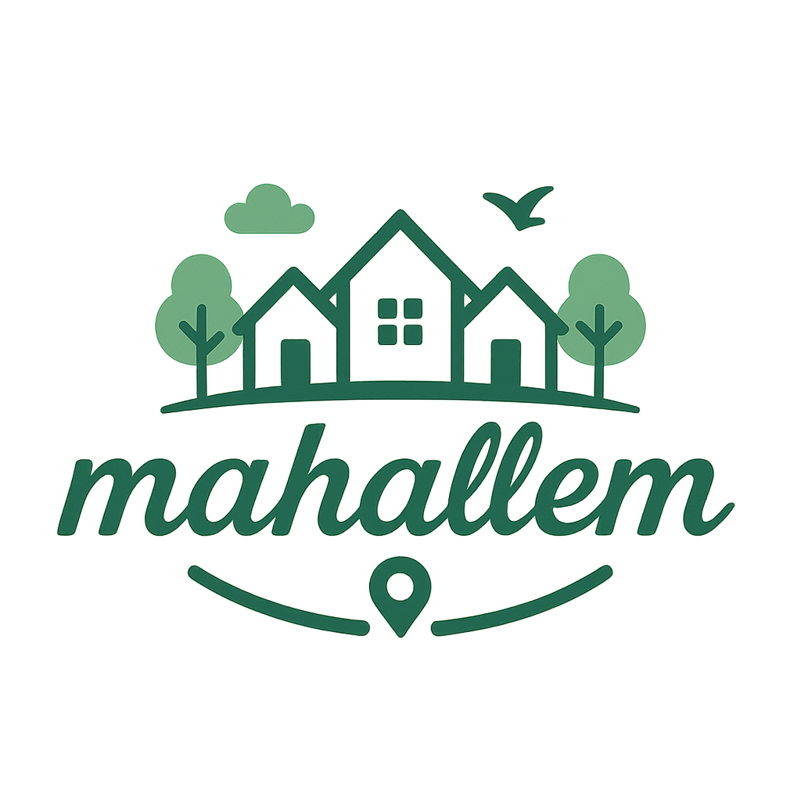

Mahallem, kullanıcıların yaşadıkları il, ilçe ve mahalleler hakkında yorum yapabildiği, diğer mahalle sakinlerinin görüşlerini okuyabildiği bir topluluk platformudur. Amacımız, yaşadığınız çevreyle ilgili daha bilinçli kararlar alabilmenizi sağlamak ve mahalle kültürünü dijital ortamda güçlendirmektir.

## 💡 Neler Sunar?

- İl, ilçe ve mahalle bazlı konum seçimi
- Kategorilere göre yorum yapma ve filtreleme
- "Benim Mahallem" özelliğiyle sadece kendi konumundaki yorumları görme
- Kullanıcı kayıt, giriş ve profil düzenleme
- Şifre sıfırlama ve güvenli oturum yönetimi

## ⚙️ Kullanılan Teknolojiler

**Frontend:**

- React.js
- Bootstrap 5
- Axios
- React Router

**Backend:**

- Node.js
- Express.js
- MySQL (AWS RDS)
- JWT Authentication
- Bcrypt

## 🌐 Canlı Demo

🟢 Uygulamanın canlı versiyonuna aşağıdan ulaşabilirsiniz:

🔗 [https://mahallem.vercel.app](https://mahallem.vercel.app)

## 📬 İletişim

Geliştirici: **İsmail Hakkı Gündoğdu**  
📧 Mail: ismailhgndgd@gmail.com 
💼 GitHub: [github.com/ismailhg](https://github.com/ismailhg)  
🔗 LinkedIn: [linkedin.com/in/ismailhakkigundogdu](https://linkedin.com/in/ismailhakkigundogdy)
